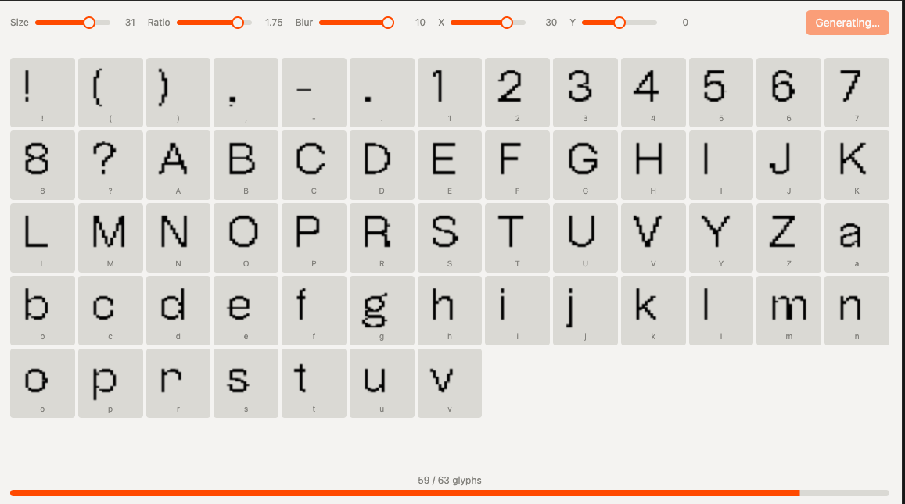

# Font Pixeler

Turn any TTF font into a pixelated version and download it as a new TTF.


## Run locally

```bash
npm install
npm run dev
```

Open the URL shown in the terminal (usually `http://localhost:5173`).

## How to use

1. **Upload font** — Click “Upload font” and choose a `.ttf` file.
2. **Adjust** — Use **Size**, **Ratio**, **Blur**, and **X** / **Y** to tune the pixel look.
3. **Preview** — A few random glyphs update live as you change settings.
4. **Export** — Click “Generate full font and download” to process all glyphs and download `pixelated-font.ttf`.




Install the downloaded font like any other TTF to use it in apps.
